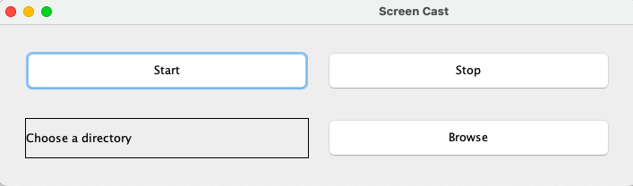
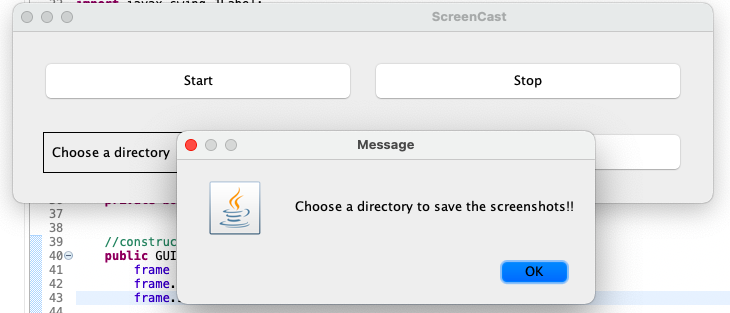
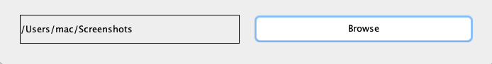
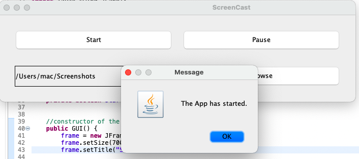
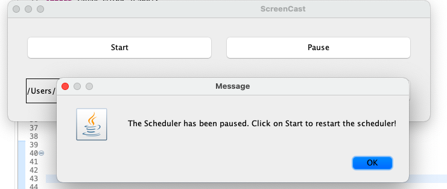
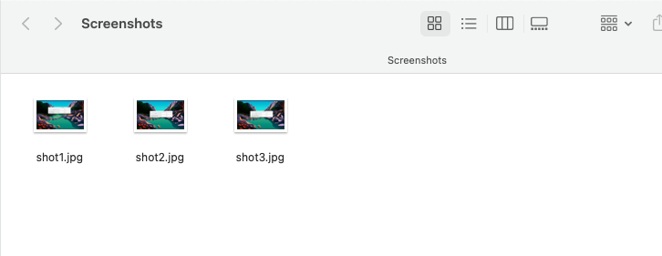

# Take screenshot of the screen through this application.

This application is built on java and can be launched in Eclipse.

The time of the scheduler can be changed in Scheduler.java at line 31:

## How to run this application?
1. Install the latest JRE. [Download JRE](https://www.oracle.com/java/technologies/downloads/#jdk19-windows)
2. Download the .jar file to run the application.
2. To use the code, download the zip folder or clone it. Open the folder in Ecipse IDE or any other IDE that supports Java.
3. The app window should appear like this:
    
4. Select the directory you want to save the screenshots to.
   
    
5. Click on the Start button to start taking screenshots.
   
6. You can pause the screenshots by clicking the pause button and can again restart it by clicking the start button.
   
7. Here are some screenshots taken by the app.

