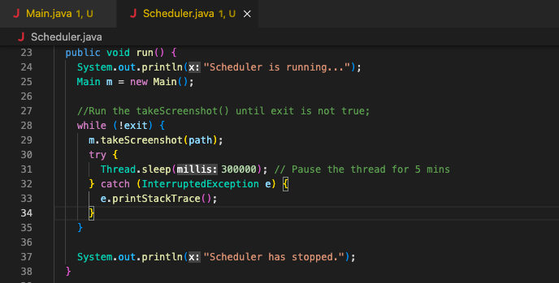

# Take screenshot of the screen through this application.

This application is built on java and can be launched in Eclipse.

The time of the scheduler can be changed in Scheduler.java at line 31:

